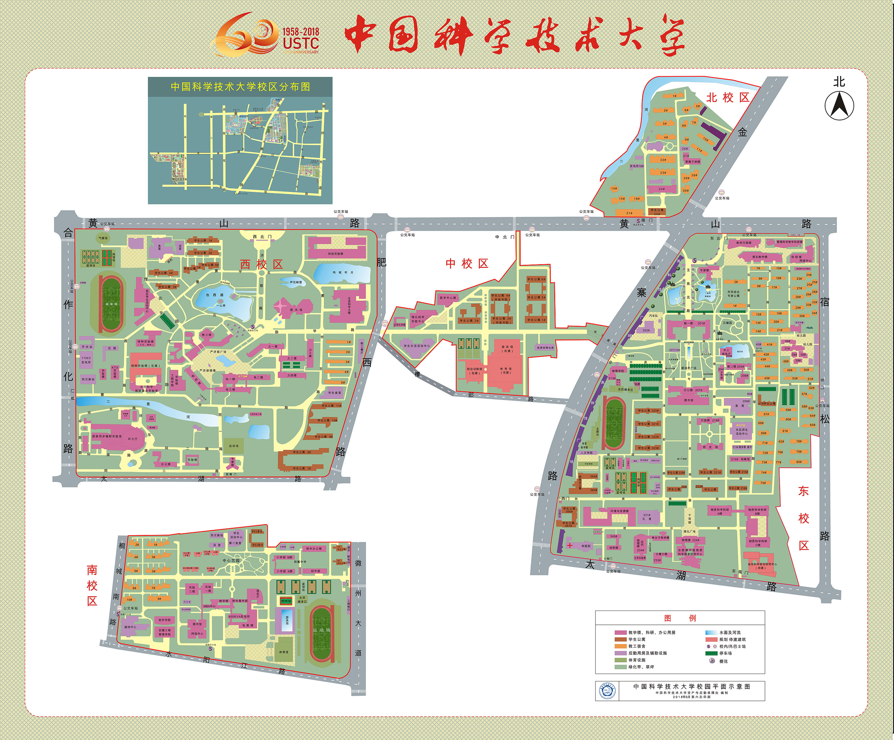
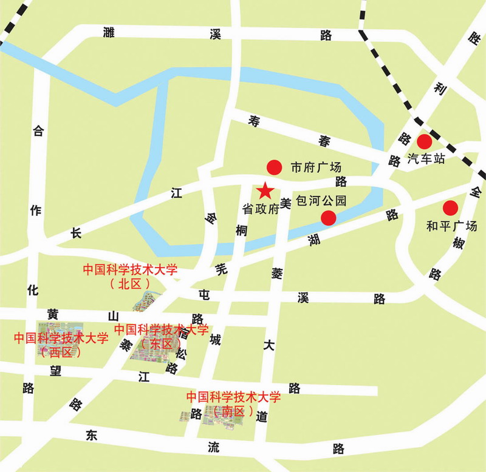
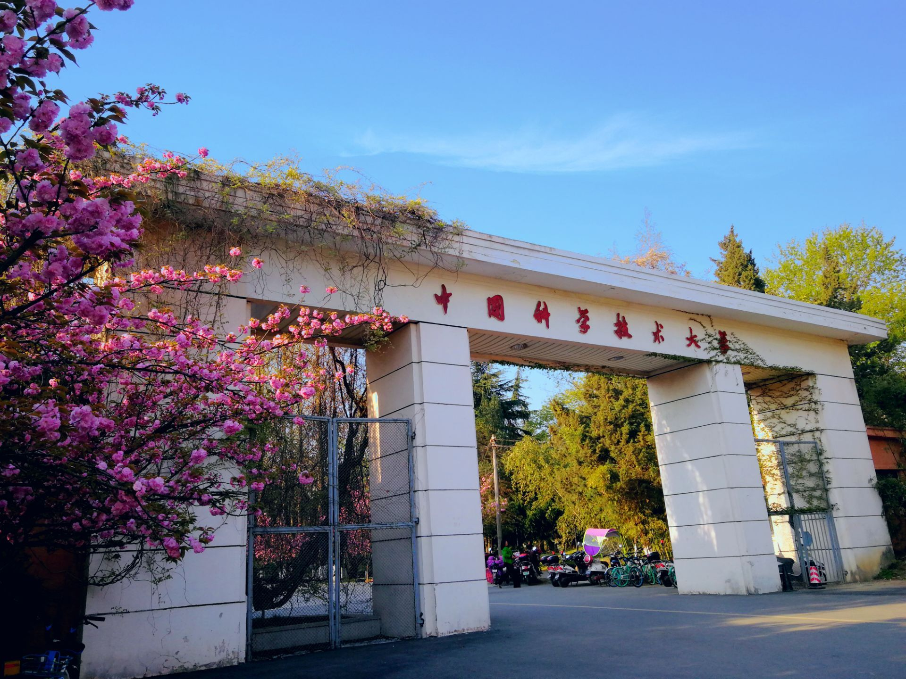
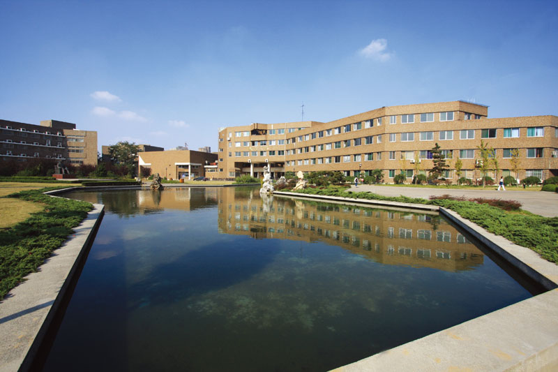
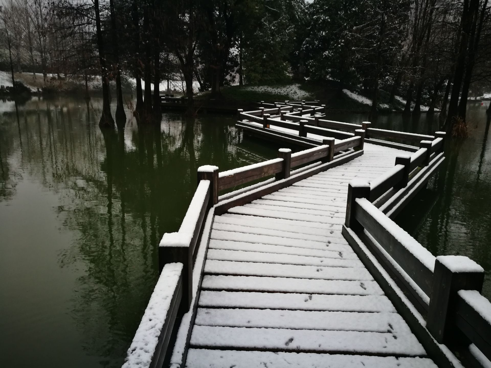
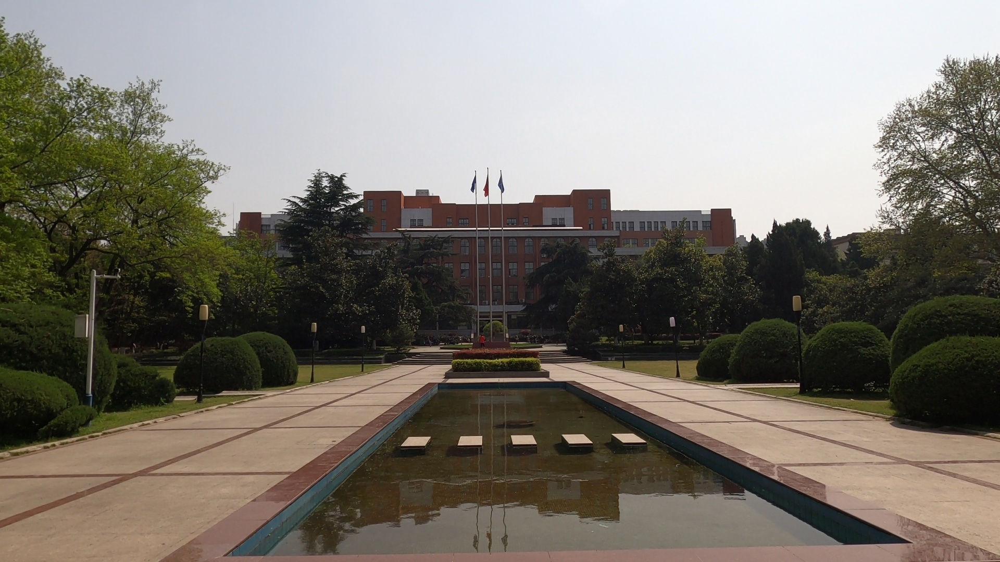
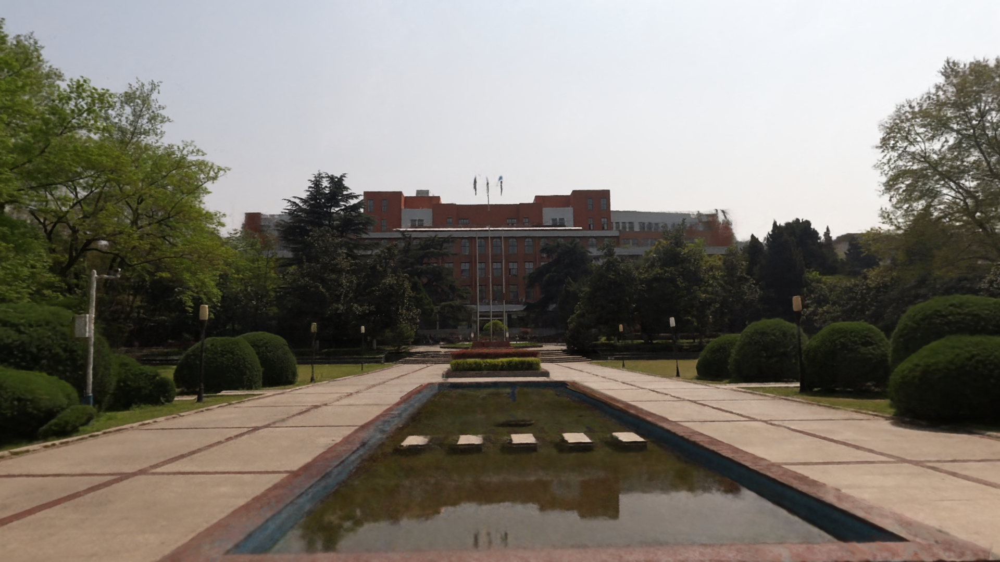
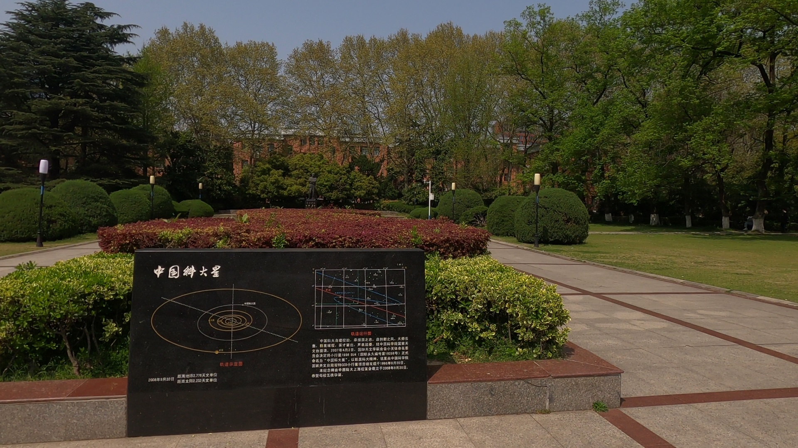

# 高保真、三维全息、数字化科大校园

在当前VR、AR、元宇宙等领域高速发展并在各行各行应用落地的时代，仅采用简单图形标注的地图、局限于个别角度的全景图像等呈现方式已无法满足大众对于如大学校园等景点、园区的沉浸式观赏与浏览。自从2020年以来，由于疫情等因素的影响导致校园封闭，因此校外人士无法自由进出校园来参观如樱花大道等校园景色；另外，对于身处外地，但对科大校园有憧憬的学生或社会人士，受限于距离、时间等限制，无法亲临学校体验观赏校园内建筑风格、景色缤纷。基于以上原因，中科大[USTC-3DV实验室](http://staff.ustc.edu.cn/~juyong/)开展了“数字化科大校园”项目，拟对整个科大校园进行全息高保真数字化，为科大的宣传、招生、已毕业校友重温校园美好时光、校外人士了解科大校园等贡献力量。

### 科大校园地图现状

截止到当前这篇文章落成之时，笔者翻阅了整个科大学校主页，仅找到了如下两张简略地图。虽然该地图清楚地展示科大校园的位置坐标与校区组成，但功能非常有限，与科大的名校地位远远不符合。可以看出，该地图还仍然停留在缩略地图的颜色与标注，根本无法进一步浏览与如实观看科大校园内如少年班、老校门、郭沫若广场、樱花大道等老百姓心心向往的科大著名标志性景点。在如今手机地图高速且便捷的时代，以上两张地图无法给人们呈现出手机地图所能呈现的更多内容，而大众更加渴望的是观赏五彩缤纷的真实科大校园景色。

<table frame=void>	<!--使用table标签，且frame=void消除外边框-->
	<tr>		   <!--<tr>一行的内容<\tr>，<td>一个格子的内容<\td>-->
    <td>

</td>	<!--
标签将图片居中-->
    <td>

</td>
    </tr>
</table>

而通过其他途径所获得的科大校园展示，更多可能也只停留在照片与视频的层面上，在某种程度上既丧失了校园景色的立体真实美感、也缺少了身临其境的交互体验，仍然停留在“看一眼”的层面上，十分缺乏吸引力与审美性。

<table frame=void>	<!--使用table标签，且frame=void消除外边框-->
	<tr>		   <!--<tr>一行的内容<\tr>，<td>一个格子的内容<\td>-->
    		<td>

</td>	<!--
标签将图片居中-->
    		<td>

</td>
		<td>

</td>
		<td>

</td>
    </tr>
</table>

再或者，对于前几年兴起的$360\degree$全景照片展示，也只能局限于固定尺度层面以及固定视角的效果展示，当浏览者想要拉近放大观看时就会出现模糊不清的问题，另一个致命的缺点是，若想查看不同尺度不同视角下的校园风景时，比如从俯瞰郭沫若广场到正面水平视角观赏，则需要切换不同的$360\degree$全景照片，增加了浏览者操作的不便性。

    
     

综合当下不同途径的科大校园景色展示的诸多弊端，足见，我们亟需一个符合科大名校地位的高大上（高保真、大规模、多尺度）科大校园数字化地图与三维模型，以便于校外人士对科大校园的浏览与体验。

### 数字化校园目标

出于实际应用的需求，以及将科研应用到具体的现实生活，我们**USTC-3DV**实验室开展了“数字化科大校园”这一项目计划，我们拟达到以下目标：

- 目标一：将科大校园的三维地图重建出来，以用于全景地貌、测量、导航等功能；
- 目标二：在任意地点对任意视角进行三维高保真全息渲染，其渲染真实性要达到高清相机拍摄的效果。

我们以谷歌今年通过车载采集设备对旧金山市几个街区所做的全息高保真数字化工作为例来说明我们拟达到的效果，具体工作介绍见[旧金山市的高保真数字化](https://www.51cto.com/article/701350.html)：

   
    
        
   

当然我们必然会有进一步的算法优化，以达到更加优秀的效果，努力追求校园景色的高逼真、多尺度还原，给使用者更加优质的浏览与观赏体验！

- 目标三：将科大校园内具有特殊意义的地方单独重建恢复出来，如名人雕像、孺子牛、少年班、老北门等具有标志性建筑或景观。 

  我们在当前项目进展中给出我们已有的雕像重建结果，以说明我们所想达到的目标效果，后续会以此进一步几何重建、全息渲染更多标志性的科大建筑物。

### 当前进展与工作安排

截止到目前，本项目已取得了部分进展：

1. 利用无人机与GoPro，对科大校园已经采集了部分用于重建工作的数据：科大校园内雕像多视角视频与图片、樱花大道的多尺度与多视角视频、郭沫若广场的多尺度与多视角视频。

   我们在下面展示一下我们抓住樱花大道全盛开的良好时期努力采集视频数据的片段，当然采集数据很多，并不会在此一一展示：

   
    
        
   

2. 对部分雕像已经完成了几何网络重建与全息渲染工作。

   <table frame=void>	<!--使用table标签，且frame=void消除外边框-->
   	<tr>		   <!--<tr>一行的内容<\tr>，<td>一个格子的内容<\td>-->
       <td>

</td>	<!--
标签将图片居中-->
       <td>

</td>
       </tr>
   </table>

3. 对郭沫若广场进行了三维全息渲染，效果逼真，高度还原现实真实场景。

   下图左侧为真实图片，**右侧为渲染图片**效果对比展示：

   <table frame=void>
   	<tr>
       <td>

</td>
       <td>

</td>
       </tr>
       <tr>	<!--第二行-->
       <td>

</td>
       <td>

</td>
       </tr>
   </table>
   

   下面给出 GIF 效果展示

   
    
        
   

   对于后续工作安排，我们也有着详细的工作安排：

   - 对已经采集的雕像（罗列出来）进行三维几何重建、全息渲染；
   - 在实验室购买足够所需的设备后，计划对科大校园进行多尺度、多视角、大规模的进行数据采集与处理工作，尤其针对标志性建筑着重单独采集；
   - 三维结构重建校园，并做到全息渲染；
   - 对标志性建筑额外单独重建出来并进行渲染。

### 所需资源

为了完成上述目标，课题组还需要购买相应的硬件资源、数据采集、数据标注等方面的资源与协助，具体包括以下内容：

1. 用于采集多视角图像数据：运动型相机、多种型号的无人机、车载相机等；
2. 用于采集场景几何特征：激光雷达；
3. 用于高效重建与渲染：高性能服务器、高配置显卡电脑，GPU资源等；
4. 在采集过程中，还需要聘期一定数量的自愿者通过各种采集设备来对校园内的各个地方进行采集。
